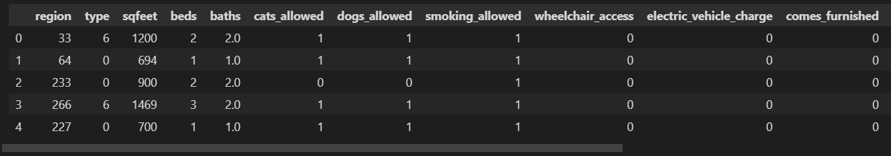

<h1 align="center"> Prediction prices houses EE.UU- Machine Learning </h1>

   
   

   
# Tabla de contenidos
* [Introducción](#Introducción)

* [Decripción del proyecto](#Descripción-del-proyecto)

* [Descripción del problema](#Descripción-del-problema)

* [Desarrollo del proyecto](#Desarrollo-del-proyecto)

* [Principales tecnologías utilizadas](#Principales-tecnologías-utilizadas)

* [Información del proyecto](#Información-del-proyecto)

* [Conclusiones](#Conclusiones)

## Introducción
Hola a todos, hoy quiero compartirles un proyecto enfocado en el área de Machine Learning en el cual se van a desarollar dos modelos: uno de aprendizaje supervisado y otro de aprendizaje no supervisado, los cuales se entrenarán para predecir el precio de una propiedad en EE.UU. 

## Descripción del proyecto

### *Mercado inmobiliario*
​Dentro de la sociedad globalizada e industrializada, es sabido que los precios de los inmuebles han presentado un constante cambio, por lo que quienes deseen invertir o vender una propiedad se enfrentan al fenómeno especulativo existente en la valorización de éstos. Esto, debido a la constante tendencia de las ciudades a crecer demográfica y comercialmente, llegando a un punto en donde no se tiene certeza de la valorización real dentro del sector en donde se desee invertir.​Pese a que el precio depende, en cierta medida, de las tendencias que esté teniendo el mercado inmobiliario en un determinado tiempo, poder estimar adecuadamente el valor de una propiedad es una referencia clave para entender si es una buena oportunidad, ya sea de compra o de venta.​

## Descripción del problema

Hemos sido contactados para el área de Machine Learning de una importante empresa inversora dentro del rubro de la inmobiliaria en Estados Unidos. ​El Team Lider le propone dos predicciones posibles, de las cuales puede elegir cuál realizar (o ambas si así lo quiere):​

1. Implementar un modelo de clasificación con aprendizaje supervisado que permita clasificar el precio de las propiedades en venta, utilizando los datos que se han puesto a su disposición. ​Para esto debe crear la columna category_price, en la cual se consideran las siguientes categorías:
    * 'low': Para precios entre 0 y 999 dólares (debe tomar valor 1 en el archivo con las predicciones).
    * 'high': Para precios desde 1000 dólares en adelante (debe tomar valor 0 en el archivo con las predicciones). ​Considerando esta categorización, el objetivo es predecir si una propiedad pertenece a la categoría de precios bajos (low).​
2. Implementar un modelo de clasificación con aprendizaje no supervisado, utilizando clustering que agrupe las propiedades por segun las siguientes categorias:
    * 'low': Para precios entre 0 y 999 dólares (debe tomar valor 1 en el archivo con las predicciones).
    * 'medium': Para precios entre 1000 y 1999 dólares (debe tomar valor 0 en el archivo con las predicciones).
    * 'high': Para precios desde 2000 dólares en adelante (debe tomar valor 0 en el archivo con las predicciones).​

Para ello, solo usaran el dataset de test provisto, eliminando previamente las caracteristicas que presenten nulos.​

# Desarrollo del proyecto

## Modelo de aprendizaje supervisado

*  EDA \
Primero cargamos los datos usando la libreria pandas, y realizamos las siguientes transformaciones para poder entrenar nuestro modelo.
    + Para las columnas 'laundry_options' y 'parking_options' rellenamos los nulos con la moda y para las columnas 'lat' y 'long' borramos los nulos.
    + Borramos las columnas 'id', 'url', 'region_url', 'image_url','description' las cuales contienen texto y no son relevantes para el modelo.
    + Para las columnas 'lat' y 'long' nos enfocamos en reestringir las latitudes y longitudes a las pertenecientes a EE.UU.
    + Creamos la columna 'category_price' y luego la codificamos con one hot encoder para finalmente borrar las columnas  'category_price' y 'price'.
    + Las columnas categóricas también las codificamos para convertirlas a numéricas.
    + Finalmente hacemos los mismos cambios en el dataset 'test.parquet' pero sin borrar nulos.

Nuestros dataframe 'train.parquet' luce así después de los cambios.

  

## Desarrollo del modelo

Después de tener los datos limpios, y observando el requerimiento del cliente nos enfocamos en implementar un modelo de aprendizaje supervisado llamado árbol del decisión.
* Predicción\
Se entrena el modelo y se utilizan métodos como GridSerachCV para escoger los mejores hiperparámetros de nuestro modelo.\
+ Rendimiento del modelo
Para evaluar el desempeño del modelo, se utilizaron las métricas de Exhaustividad (Recall) de precisión (Accuracy), basándonos en la matriz de confusión,
 el cual nos arroja:
    * `Recall: 0.9013`
    * `Accuracy: 0.9047` 

Como los resultados estan por encima de 90 indica que el modelo predice muy bien con datos nuevos. 

## Aprendizaje no supervisado
Para esta instancia nos enfocamos en algoritmos de clustering como el algoritmo de k-means el cual nos ayudará a agrupar en las tres categorías que nos piden: 'low', 'medium' y 'high'.

* Modelado\
Se crea el modelo de aprendizaje no supervisado  (k-means), usando el dataset 'test.parquet' y previamente haciendo limpieza de los datos.

+ Rendimiento del modelo\
Para evaluar el desempeño del modelo, se utiliza las métrica  de `Silhouette score`. La cual nos arroja:
    * `Silhouette score: 0.6235`

El cual es número cercano a 1, lo cual indica que nuestro modelo no es el mejor pero predice bastante bien.

## Principales tecnologías utilizadas

* Python
    + pandas
    + scikit learn
    + seaborn
    + matplotlib

## Información del proyecto
Puede encontrar toda la información inicial de este proyecto en: https://github.com/soyHenry/Datathon.git

## Conclusiones:

Este fue un proyecto desafiante en el que se logra interiorizar los conceptos de Machine Learning, Aprendizaje supervisado no supervisado así mismo los diferentes algorítmos de clasificación. En este proyecto see logra el objetivo principal, el cual era predecir el precio de una propiedad en los Estados Unidos usando alguno de las dos ramas del ML.

Gracias por haber llegado hasta aquí 💛.

Les dejo mi LinkedIn https://www.linkedin.com/in/camilo-pedreros-106a1a245/ ¿Conectamos? 😉
